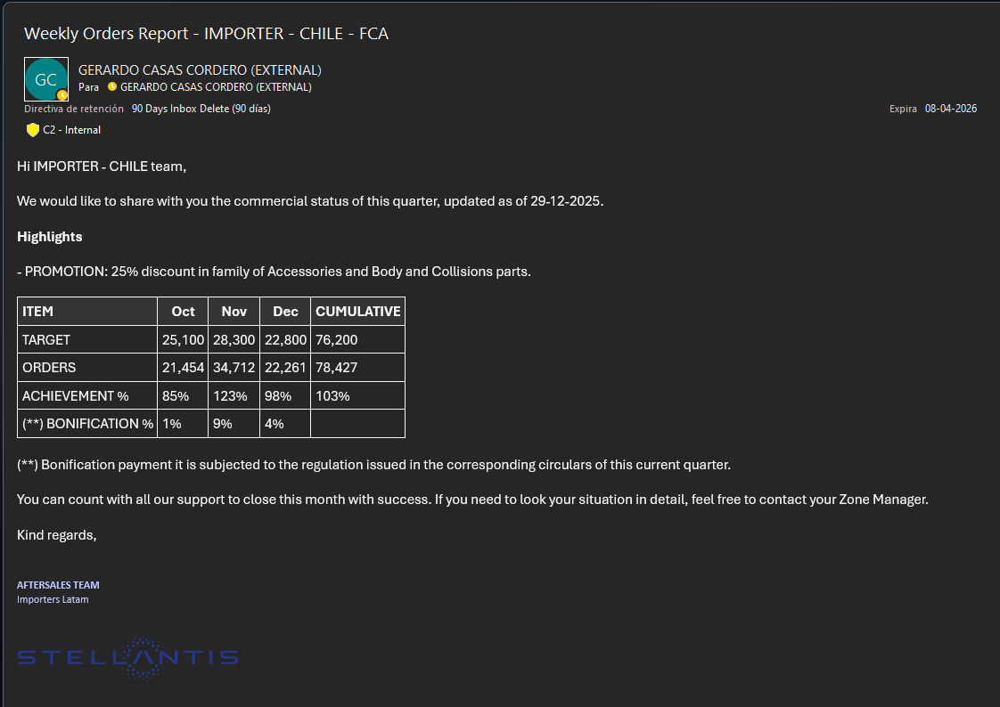

# Automated Commercial Reporting

Automated distribution of commercial performance reports built on top of an
ERP ETL pipeline.

## Overview
This module consumes processed ERP sales data to generate commercial reports
and automatically deliver them via email to business stakeholders.

## Key Features
- Automated Excel report generation
- HTML-formatted email bodies with key KPIs
- Scheduled email delivery using Python

## Technologies
- Python
- pandas
- HTML
- Outlook automation (win32com)

## Notes
All data shown in this project is fictitious or anonymized. The original
implementation used confidential commercial data.

## Preview

